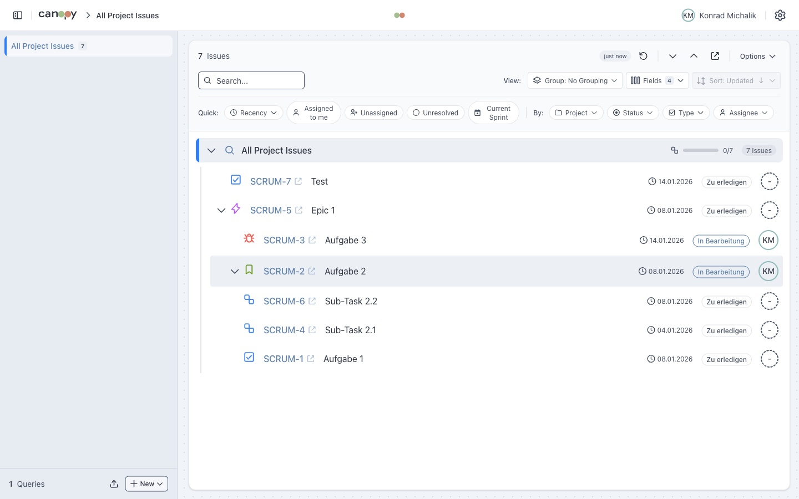

# JIRA Tree Viewer

A web application for displaying JIRA tickets in a hierarchical tree structure (Epic → Story → Task → Subtask).



## Features

### Core Features
- **Hierarchical Tree View**: Display tickets with correct parent-child relationships (Epic → Story → Task → Subtask)
- **Multiple JQL Queries**: Save and manage multiple JQL queries with custom titles and colors
- **JIRA Cloud & Server**: Full support for both JIRA Cloud and Server/Data Center instances
- **Local Storage**: All settings, queries, and preferences are stored in the browser
- **Import/Export**: Export and import your complete configuration as JSON for backup or use on different devices

### Filtering & Search
- **Quick Filters**: Pre-defined filters like "Assigned to me", "Unassigned", "Unresolved", and "Current Sprint"
- **Dynamic Filters**: Automatically generated filters based on loaded issues:
  - Status (with color-coded badges)
  - Issue Type (with JIRA icons)
  - Assignee (with avatars)
  - Priority (with JIRA icons)
  - Resolution
  - Components
  - Fix Versions
- **Recency Filters**: Filter by recently created, recently updated, or recently commented issues (last 7 days)
- **Text Search**: Search issues by key or summary with partial matching (e.g., "127" finds "PROJECT-127")
- **Filter Persistence**: Active filters are saved per query and restored when switching between queries

### Display Options
- **Sorting**: Sort issues within hierarchy levels by Key, Priority, Created, Updated, or Status (ascending/descending)
- **Display Density**: Toggle between comfortable and compact view modes
- **Configurable Fields**: Choose which fields to display on issue cards:
  - Progress (individual issue)
  - Aggregated Time Progress (sum of children)
  - Aggregated Resolution Progress (sum of children)
  - Status, Assignee, Priority
  - Created/Updated dates
  - Comments count
  - Components, Labels
  - Resolution, Fix Versions
- **Collapsible Nodes**: Expand/collapse individual nodes or all nodes at once
- **Resizable Sidebar**: Drag to resize the query sidebar

### Theming
- **Dark Mode**: Full support for light and dark themes
- **System Theme**: Automatically follows your system's theme preference

### Developer Tools
- **Debug Mode**: Toggle debug logging in the browser console for troubleshooting

## Getting Started

### Prerequisites

- Node.js 18+
- npm or yarn

### Installation

```bash
# Install dependencies
npm install

# Start development server
npm run dev
```

### Production Build

```bash
npm run build
npm run preview
```

## CORS Proxy

Due to browser CORS restrictions, you need to run a proxy server for local development.

### Using the Included Proxy

```bash
cd proxy
npm install
export JIRA_BASE_URL=https://your-domain.atlassian.net
npm start
```

The proxy runs on `http://localhost:3001`.

### Connection Setup

1. Enter your JIRA URL in the **JIRA URL** field (e.g., `https://your-domain.atlassian.net`)
2. Expand **Advanced: CORS Proxy** and enter `http://localhost:3001/jira`
3. Enter your credentials (see Configuration below)

## Configuration

### JIRA Cloud

1. Go to https://id.atlassian.com/manage-profile/security/api-tokens
2. Create an API token
3. Enter your JIRA Cloud URL (e.g., `https://your-domain.atlassian.net`)
4. Enter your email and API token

### JIRA Server/Data Center

1. Create a Personal Access Token in JIRA settings
2. Enter your JIRA Server URL
3. Enter your username and PAT (or use Basic Auth with username/password)

## How It Works

### Hierarchy Detection

The app automatically detects parent-child relationships using (in order of priority):
1. The `parent` field (used in JIRA Cloud and for subtasks)
2. Epic Link custom field (for Server/Data Center instances)
3. Issue links with parent-child relationships

### Sorting Behavior

Issues are always sorted by hierarchy level first (Epic > Story > Task > Subtask), then by your selected secondary sort field. This ensures the tree structure remains logical regardless of sort settings.

### Filter Logic

- Filters within the same category (e.g., multiple statuses) are combined with **OR**
- Filters from different categories are combined with **AND**
- Example: Selecting "In Progress" + "In Review" (status) AND "High" (priority) shows issues that are (In Progress OR In Review) AND High priority

## Tech Stack

- **Svelte 5** with TypeScript and Runes for reactive state management
- **Tailwind CSS v4** for styling
- **Vite** as build tool
- **Atlaskit Tokens** for JIRA-consistent theming

## Project Structure

```
src/
├── lib/
│   ├── api/          # JIRA API clients (Cloud & Server)
│   ├── components/   # Svelte components
│   │   ├── common/   # Shared UI components
│   │   ├── connection/ # Connection form
│   │   ├── filters/  # Filter dropdowns
│   │   ├── jql/      # Query management
│   │   ├── layout/   # Main layout, sidebar
│   │   ├── screens/  # Full-page screens
│   │   └── tree/     # Tree view components
│   ├── stores/       # Svelte 5 state management (.svelte.ts)
│   ├── types/        # TypeScript types
│   └── utils/        # Utility functions
├── App.svelte        # Root component
└── main.ts           # Entry point

proxy/                # CORS proxy server
└── server.js
```

## License

MIT
