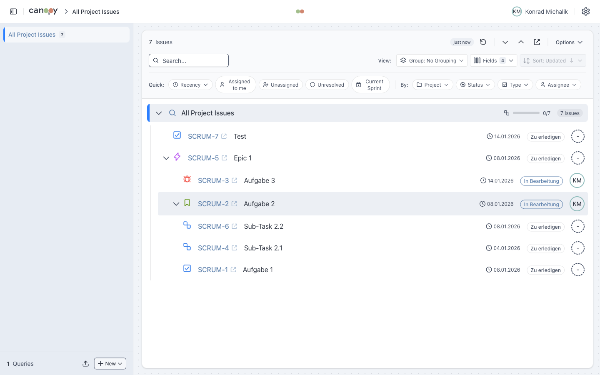

<p align="center">
  
</p>

<h1 align="center">Canopy</h1>

<p align="center">
  <strong>A hierarchical Jira issue viewer that displays tickets in a tree structure</strong>
</p>

<p align="center">
  
  
  
  
</p>

<p align="center">
  <a href="https://jira-canopy.vercel.app">Try Online</a> •
  <a href="https://konradmichalik.github.io/canopy/">Documentation</a> •
  <a href="https://konradmichalik.github.io/canopy/desktop/">macOS App</a>
</p>

---



Canopy visualizes Jira issues in a hierarchical tree view (Epic → Story → Task → Subtask), making it easy to understand project structure and track progress across your team.

## ✨ Features

- **Tree View** - Hierarchical display with expand/collapse, progress aggregation, vim-style keyboard navigation
- **Filtering** - Quick filters, dynamic filters, saved presets, text search
- **Grouping** - By Sprint, Assignee, Status, Project, or Recency
- **Change Tracking** - Checkpoint-based change detection (Beta)
- **Theming** - Light/dark mode with 6 accent colors
- **macOS Desktop App** - Native Tauri app without CORS proxy

## 🚀 Three Ways to Use Canopy

| Option | Description | CORS Proxy |
|--------|-------------|------------|
| **[Online](https://jira-canopy.vercel.app)** | Use directly in browser | Required |
| **[macOS App](https://konradmichalik.github.io/canopy/desktop/)** | Native desktop app | Not needed |
| **Local** | Run from source | Required |

### Quick Start (Local)

```bash
git clone https://github.com/konradmichalik/canopy.git
cd canopy
npm install
npm run dev
```

> **Note:** A [CORS proxy](https://konradmichalik.github.io/canopy/getting-started/installation#cors-proxy) is required for browser access.

## 📋 Requirements

- Node.js 18+
- Jira Cloud or Server/Data Center instance
- API Token (Cloud) or Personal Access Token (Server)

## 📖 Documentation

Full documentation available at **[konradmichalik.github.io/canopy](https://konradmichalik.github.io/canopy/)**

## 🛠️ Tech Stack

- **[Svelte 5](https://svelte.dev/)** with TypeScript and Runes
- **[Tailwind CSS v4](https://tailwindcss.com/)** for styling
- **[shadcn-svelte](https://www.shadcn-svelte.com/)** UI components
- **[Tauri](https://tauri.app/)** for macOS desktop app

## 📄 License

MIT
